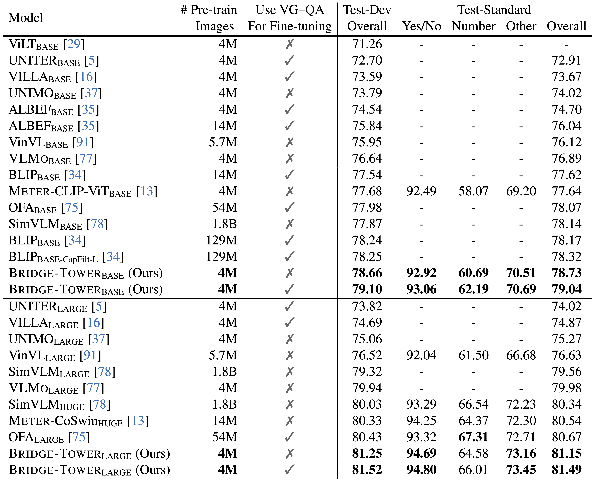
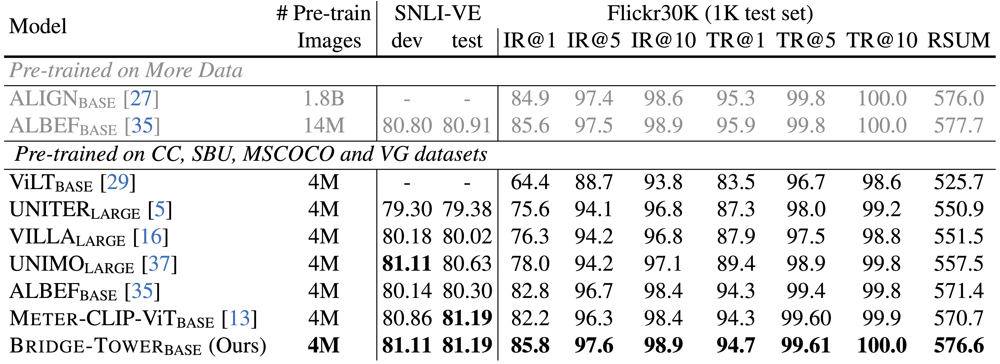

# Bridge-Tower

This repo is the official implementation of ["Bridge-Tower: Building Bridges Between Encoders in Vision-Language Representation Learning"](https://arxiv.org/abs/2206.08657).

## Updates
- June, 2022: release preprint in [Arxiv](https://arxiv.org/abs/2206.08657).
- May, 2022: Bridge-Tower (single model, 4M data) achieves 78.73% and 81.15% (base and large) on the [VQAv2 Challenge](https://eval.ai/web/challenges/challenge-page/830/leaderboard/2278) test-std set.

## Abstract
Vision-Language (VL) models with the Two-Tower architecture have dominated visual-language representation learning in recent years. Current VL models either use lightweight uni-modal encoders and learn to extract, align and fuse both modalities simultaneously in a cross-modal encoder, or feed the last-layer uni-modal features directly into the top cross-modal encoder, ignoring the semantic information at the different levels in the deep uni-modal encoders. Both approaches possibly restrict vision-language representation learning and limit model performance. In this paper, we introduce multiple bridge layers that build a connection between the top layers of uni-modal encoders and each layer of the cross-modal encoder. This enables comprehensive bottom-up interactions between visual and textual representations at different semantic levels, resulting in more effective cross-modal alignment and fusion. Our proposed Bridge-Tower, pre-trained with only 4M images, achieves state-of-the-art performance on various downstream vision-language tasks. On the VQAv2 test-std set, Bridge-Tower achieves an accuracy of 78.73%, outperforming the previous state-of-the-art METER model by 1.09% with the same pre-training data and almost no additional parameters and computational cost. Notably, when further scaling the model, Bridge-Tower achieves an accuracy of 81.15%, surpassing models that are pre-trained on orders-of-magnitude larger datasets.

## Architecture


## Main Results





## Citation

```
@article{xu2022bridgetower,
      title={Bridge-Tower: Building Bridges Between Encoders in Vision-Language Representation Learning}, 
      author={Xiao Xu and Chenfei Wu and Shachar Rosenman and Vasudev Lal and Nan Duan},
      year={2022},
      eprint={2206.08657},
      archivePrefix={arXiv},
      primaryClass={cs.CV}
}
```


